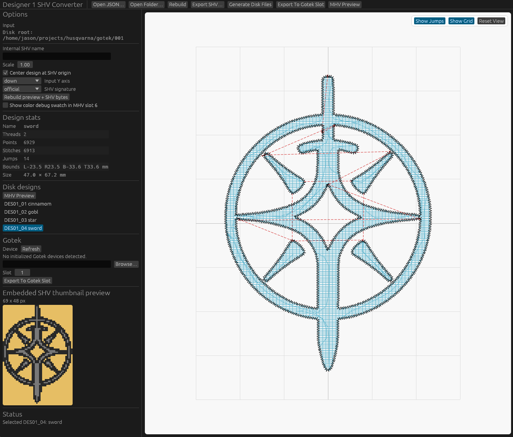

# digiorno-stitchworks

Rust tools for working with Husqvarna/Viking Designer 1 embroidery media.

This project focuses on practical interoperability with real Designer 1 hardware. It can load and normalize Ink/Stitch JSON exports, write Designer 1 `SHV` design files, build `PHV`/`MHV` menu assets, assemble FAT12 floppy images, and manage Gotek slot images from both a CLI and a desktop GUI.



## Features

- Convert Ink/Stitch JSON into Designer 1 `SHV` files.
- Validate generated `SHV` files by decoding the emitted stitch stream.
- Export a single-menu Designer 1 disk layout with `MENU_SEL.PHV`, `MENU_0X.MHV`, and `DES01_XX.SHV`.
- Build and inspect 1.44MB FAT12 floppy images for Designer 1 media.
- Manage Gotek workspaces, slot images, device writes, and verification.
- Preview designs and machine-style graphics in an `egui` desktop app.

## Project Status

The format work here is empirical and machine-driven. `PHV`/`MHV` generation and the current `SHV` writer have been validated against known-good media and on-machine behavior documented in [FORMAT_NOTES.md](FORMAT_NOTES.md), but the Designer 1 formats are not fully specified by Husqvarna/Viking.

If you are changing machine-facing output, treat byte-for-byte comparisons and on-machine testing as the final authority.

## Binaries

This repository builds three user-facing binaries plus a compatibility CLI entrypoint:

- `designer1`: combined entrypoint; runs CLI subcommands by default and launches the GUI with `--gui`
- `designer1-cli`: CLI-only entrypoint for design conversion, validation, preview, and disk export
- `designer1-gui`: GUI-only entrypoint
- `designer1-gotek`: lower-level Gotek and FAT12 image management CLI

## Build

```bash
cargo build
cargo build --release
```

Run the combined binary:

```bash
cargo run --bin designer1 -- --help
cargo run --bin designer1 -- --gui
```

Run the dedicated entrypoints:

```bash
cargo run --bin designer1-cli -- --help
cargo run --bin designer1-gui
cargo run --bin designer1-gotek -- --help
```

## CLI Usage

Convert Ink/Stitch JSON to `SHV`:

```bash
cargo run --bin designer1 -- convert design.json \
  --output DESIGN01.SHV \
  --signature official \
  --validation-report design-readback.json
```

Inspect normalized design statistics:

```bash
cargo run --bin designer1 -- inspect design.json
```

Write an SVG path preview:

```bash
cargo run --bin designer1 -- preview-svg design.json \
  --output design-preview.svg
```

Validate a generated `SHV` file:

```bash
cargo run --bin designer1 -- validate-shv DESIGN01.SHV
```

Export a single-menu disk folder from JSON inputs in a directory:

```bash
cargo run --bin designer1 -- export-disk ./disk-project \
  --disk-title "My Disk" \
  --menu-label "Menu 1"
```

The disk export expects JSON files in the root folder and writes Designer 1 menu assets alongside generated design files:

```text
disk-project/
  MENU_SEL.PHV
  MENU_01/
    DES01_01.SHV
    DES01_02.SHV
    ...
    MENU_01.MHV
  MENU_02/
    MENU_02.MHV
  MENU_03/
    MENU_03.MHV
  MENU_04/
    MENU_04.MHV
```

## Gotek Workflow

Initialize a managed Gotek workspace:

```bash
cargo run --bin designer1-gotek -- init --root gotek
```

Pack workspace slot folders into `.floppy.img` files:

```bash
cargo run --bin designer1-gotek -- pack --root gotek
```

Write selected slots to a Gotek device or bank file:

```bash
cargo run --bin designer1-gotek -- write --root gotek /dev/sdX 1 2 3 --confirm-device
```

Verify selected slots against the device contents:

```bash
cargo run --bin designer1-gotek -- verify --root gotek /dev/sdX 1 2 3
```

Create a blank FAT12 floppy image:

```bash
cargo run --bin designer1-gotek -- mkimg blank.img --label DESIGNER1
```

Inspect a floppy image:

```bash
cargo run --bin designer1-gotek -- inspect-image blank.img
```

The Gotek CLI also supports raw slot reads, single-slot writes, single-slot verification, and `sync` to pack and write changed workspace slots in one step.

## GUI

Launch the desktop app with either:

```bash
cargo run --bin designer1 -- --gui
```

or:

```bash
cargo run --bin designer1-gui
```

The GUI is intended as both a working frontend and an inspection surface. It can load designs, preview stitch geometry, show machine-style previews, export disk assets, and help verify what will actually be written to media.

## Validation

For format or media changes, a useful workflow is:

```bash
cargo test --quiet
cargo check --quiet --bin designer1-gui --bin designer1-cli
cargo run --bin designer1 -- validate-shv path/to/file.SHV
cargo run --bin designer1 -- export-disk path/to/folder
```

For Gotek and disk image checks, use `designer1-gotek` together with standard tools such as `mdir`, `mcopy`, `xxd`, `cmp`, and `sha256sum`.

## Documentation

- [FORMAT_NOTES.md](FORMAT_NOTES.md): current format notes for `SHV`, `PHV`, `MHV`, disk layout, and verified constants
- `src/`: Rust implementation of the core library, CLI frontends, GUI, and Gotek tooling

## License

Licensed under either of:

- MIT
- Apache-2.0

at your option.
